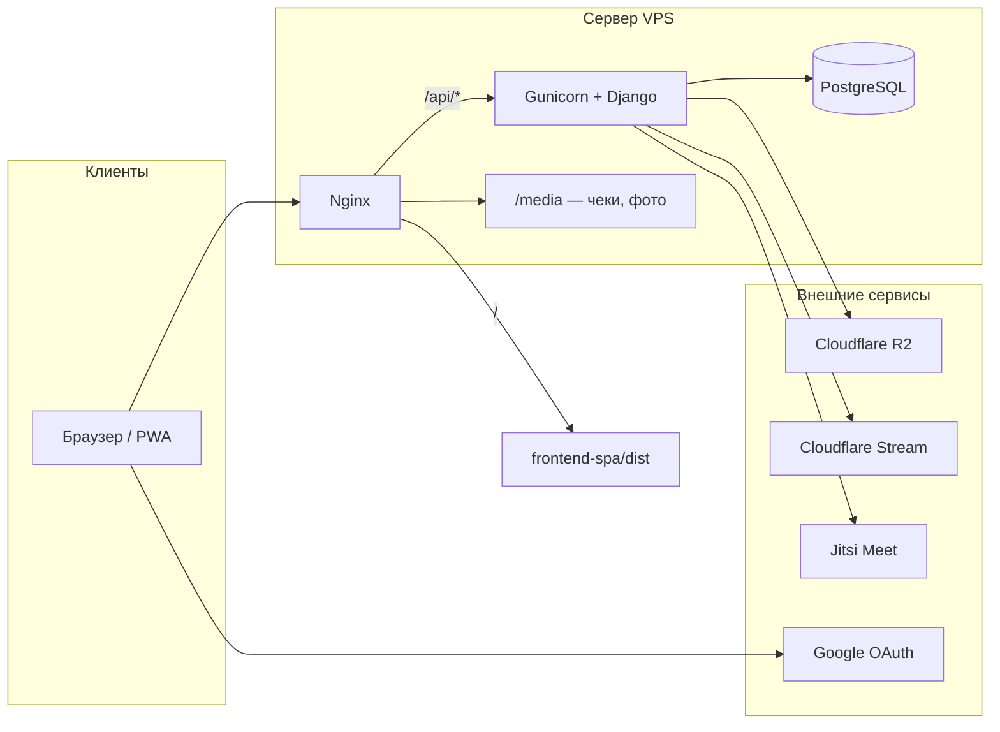

# Asylzada Fitness CRM

CRM для фитнес-школы **Асылзада**: учёт клиентов, групп, оплат, посещаемости и модуль онлайн-обучения (уроки, эфиры, консультации). Продакшен: [https://crm.aiym-syry.kg](https://crm.aiym-syry.kg).

| Документ | Аудитория |
|----------|-----------|
| [frontend-spa/README.md](frontend-spa/README.md) | Frontend-разработчики |
| [BACKEND.md](BACKEND.md) | Backend-разработчики |
| [CLAUDE.md](CLAUDE.md) | Правила работы с репозиторием (модуль education) |

---

## О проекте

### Что делает проект

**Asylzada Fitness CRM** — веб-приложение для управления фитнес-школой: регистрация и сопровождение клиентов, потоки (группы), тренеры, оплаты (полная и рассрочка), бонусы, посещаемость офлайн-групп, аналитика. Отдельный **личный кабинет ученика** даёт доступ к видео/аудио/текстовым урокам, прямым эфирам и архиву записей. Администраторы ведут контент обучения и эфиры через staff-интерфейс.

### Какую проблему решает

- Централизует данные клиентов и оплат вместо разрозненных таблиц и мессенджеров.
- Разделяет роли: **админ** (полный доступ), **регистратор** (мобильный сценарий записи клиентов), **ученик** (кабинет с ограниченным API).
- Связывает доступ к урокам с **группой клиента** и (для онлайн) с **тегами подписки** группы.
- Интегрирует внешние сервисы для медиа: Cloudflare Stream (видео и live), R2 (аудио), Jitsi (1-на-1 консультации).

### Для кого предназначен

| Роль | Интерфейс | Аутентификация |
|------|-----------|----------------|
| Администратор | `/admin/*` (React SPA) | Staff JWT (`/api/accounts/token/`) |
| Регистратор | `/mobile/*` | Staff JWT, роль `registrar` |
| Ученик | `/cabinet/*` | Cabinet JWT (`/api/cabinet/login/`) |
| Гость консультации | `/room/:uuid` | Публичные endpoints без JWT |

### Как работает система в целом



1. **Nginx** отдаёт собранный React (`frontend-spa/dist`), проксирует `/api/` на Gunicorn, раздаёт `/static/` и `/media/`.
2. **Django REST Framework** обрабатывает бизнес-логику; ViewSet'ы делегируют в **сервисы** (`core.services.BaseService` и `apps/*/services.py`).
3. **Frontend** — одна SPA на Vite: маршруты `/login`, `/admin`, `/mobile`, `/cabinet`, `/room`.
4. **Axios** подставляет staff- или cabinet-токен по префиксу URL (`frontend-spa/src/api/axios.js`).

### Основные возможности

- CRUD клиентов, групп, тренеров; soft delete (`deleted_at`).
- Оплата: полная, рассрочка, чеки (`/media/`), возвраты, параллельные записи в несколько групп.
- Бонусная система (начисление/списание при оплате).
- Посещаемость офлайн-клиентов по датам и группам.
- Статистика: дашборд, по группам/тренерам, корзина удалённых сущностей.
- Education: уроки (video/audio/text), live с WHIP/WebRTC, чат, гость на сцене, архив, консультации Jitsi, webhook Cloudflare Stream.
- Кабинет: логин по паролю или Google, лента уроков, прогресс просмотра.

---

## Архитектура проекта

### Frontend

- **Путь:** `frontend-spa/`
- **Стек:** React 18, Vite 5, React Router 6, Tailwind CSS 3, Axios.
- **Состояние:** React Context (`AuthContext`, `UploadContext`, `RefreshContext`), локальный state в страницах. **Redux / RTK Query не используются.**
- **Сборка:** `npm run build` → `dist/`, PWA через `vite-plugin-pwa`.
- Подробности: [frontend-spa/README.md](frontend-spa/README.md).

### Backend

- **Путь:** корень репозитория (Django project `config`).
- **Стек:** Django 4.2, DRF, PostgreSQL, SimpleJWT (staff), кастомный HS256 JWT (cabinet).
- **Паттерн:** приложения в `apps/`, общий код в `core/`.
- Подробности: [BACKEND.md](BACKEND.md).

### База данных

- **СУБД:** PostgreSQL (`config/settings/base.py` → `DATABASES`).
- **ORM:** Django models; UUID PK у большинства сущностей (`core.models.UUIDTimestampedModel`).
- **Миграции:** `python manage.py migrate` по приложениям в `apps/*/migrations/`.

### Авторизация

| Тип | Механизм | Endpoints | Хранение на клиенте |
|-----|----------|-----------|---------------------|
| Staff | `rest_framework_simplejwt` | `/api/accounts/token/`, `token/refresh/`, `me/` | `access_token`, `refresh_token` |
| Cabinet | PyJWT HS256, claim `type: 'cabinet'` | `/api/cabinet/login/`, `token/refresh/`, `google-auth/` | `cabinet_access_token`, `cabinet_refresh_token` |

Одна активная сессия кабинета: при входе ротируется `ClientAccount.session_key` (`apps/clients/cabinet_auth.py`).

### API

- Префикс: `/api/`
- Роутинг: `config/urls.py` + `DefaultRouter` для ресурсов.
- Пагинация: `core.pagination.StandardResultsPagination` (по умолчанию 25, `page_size` до 1000).
- Ошибки домена: `core.exception_handler.custom_exception_handler`.

### Хранение данных

| Данные | Где |
|--------|-----|
| Реляционные | PostgreSQL |
| Чеки, локальные изображения | `MEDIA_ROOT` → `/media/` на сервере |
| Аудио уроков | Cloudflare R2 (S3 API, `boto3`) |
| Видео, live, записи эфиров | Cloudflare Stream |
| Консультации | Jitsi (self-host, `JITSI_DOMAIN`) |

### Взаимодействие между сервисами

- **Webhook** `POST /api/education/webhooks/cf-stream/` — события Stream (готовность записи эфира → урок).
- **TUS / presigned URL** — загрузка видео/аудио с фронта в Stream/R2 через staff API.
- **WHIP proxy** — браузерный эфир с админ-страницы `BroadcastPage`.
- **Google** — верификация ID token на backend (`GOOGLE_CLIENT_ID`), кнопка на фронте (`VITE_GOOGLE_CLIENT_ID`).

---

## Технологический стек

| Технология | Зачем в проекте |
|------------|-----------------|
| **Django 4.2** | ORM, админка, WSGI, миграции |
| **Django REST Framework** | REST API, ViewSet'ы, сериализаторы, permissions |
| **djangorestframework-simplejwt** | Access/refresh для staff, blacklist при ротации |
| **PostgreSQL** | Основное хранилище |
| **psycopg2-binary** | Драйвер PostgreSQL |
| **python-decouple** | Чтение `.env` в settings |
| **django-cors-headers** | CORS (dev: все origins; prod: `CORS_ALLOWED_ORIGINS`) |
| **django-filter** | Фильтры query string в ViewSet'ах |
| **Pillow** | `ImageField` для чеков |
| **boto3 / django-storages** | R2 (S3-compatible) |
| **PyJWT** | Cabinet JWT |
| **requests** | HTTP к Cloudflare, Google tokeninfo |
| **gunicorn** | WSGI в продакшене |
| **React 18** | UI SPA |
| **Vite 5** | Dev server, сборка, HMR |
| **React Router 6** | Маршрутизация, lazy routes |
| **Tailwind CSS 3** | Стили |
| **Axios** | HTTP-клиент, interceptors refresh |
| **@headlessui/react** | Доступные UI-примитивы |
| **@vidstack/react**, **hls.js** | Видеоплеер |
| **wavesurfer.js** | Аудиоплеер |
| **tus-js-client** | Дозагрузка видео в Stream |
| **recharts** | Графики в статистике |
| **jspdf**, **html2canvas** | PDF/экспорт |
| **vite-plugin-pwa** | PWA, service worker |
| **Docker / docker-compose** | Локальный Postgres + web (опционально) |
| **Nginx** | Reverse proxy, SSL, статика SPA |

**Не используются в текущем коде:** Next.js, TypeScript (frontend на JSX), Prisma, Redux, RTK Query, Supabase.

---

## Структура проекта

```
fitness-crm/
├── config/                 # Django project: settings, urls, wsgi/asgi
│   └── settings/
│       ├── base.py         # Общие настройки, R2/Stream/Jitsi, DRF, JWT
│       ├── development.py  # DEBUG, CORS_ALLOW_ALL_ORIGINS
│       └── production.py   # SSL cookies, CORS_ALLOWED_ORIGINS
├── core/                   # Базовые модели, pagination, permissions, exceptions
│   └── management/commands/
│       ├── create_staff_users.py
│       └── fill_test_data.py
├── apps/
│   ├── accounts/           # User (admin/registrar), managers, staff JWT
│   ├── clients/            # Client, cabinet, bonuses, enrollments
│   ├── groups/             # Group (потоки)
│   ├── trainers/           # Trainer (не связан с Django User)
│   ├── payments/           # FullPayment, InstallmentPlan, RefundLog
│   ├── attendance/         # Посещаемость офлайн
│   ├── statistics/         # Агрегаты и trash API
│   ├── education/          # Уроки, эфиры, консультации, webhooks
│   ├── admin_panel/        # Legacy Django templates (не в INSTALLED_APPS)
│   └── frontend/           # Legacy Django templates (не в INSTALLED_APPS)
├── frontend-spa/           # Актуальный React SPA
├── deploy/                 # nginx.conf, gunicorn.service, update.sh
├── requirements/           # base.txt, development.txt, production.txt
├── scripts/                # Вспомогательные скрипты (check_storage.py)
├── .env.example            # Шаблон переменных окружения
├── manage.py
├── Dockerfile
├── docker-compose.yml
├── README.md               # Этот файл
└── BACKEND.md              # Backend-документация
```

### Назначение ключевых директорий

- **`config/`** — точка входа URL (`config/urls.py`), выбор settings через `DJANGO_SETTINGS_MODULE`.
- **`apps/*`** — доменные Django-приложения; каждое обычно содержит `models.py`, `views.py`, `serializers.py`, `services.py`, `urls.py` (если отдельный include).
- **`core/`** — переиспользуемые абстракции (`UUIDTimestampedModel`, `BaseService`, `IsAdmin`, пагинация).
- **`frontend-spa/src/pages/`** — страницы по зонам: `admin/`, `mobile/`, `cabinet/`, `public/`.
- **`deploy/`** — конфигурация продакшен-сервера Timeweb VPS.

---

## Быстрый запуск

### Требования

- Python 3.11+
- Node.js 18+ (для frontend)
- PostgreSQL 15+ (локально или через Docker)

### 1. Клонирование и окружение

```bash
cd fitness-crm
python -m venv .venv
source .venv/bin/activate   # Windows: .venv\Scripts\activate
pip install -r requirements/development.txt
cp .env.example .env        # заполнить значения
```

### 2. База данных

**Вариант A — Docker Compose:**

```bash
docker compose up -d db
# В .env: DB_HOST=db, DB_NAME=fitness_crm, DB_USER=fitness_user, DB_PASSWORD=fitness_dbpassword
```

**Вариант B — локальный PostgreSQL:**

```bash
# В .env: DB_HOST=localhost, DB_NAME=fitness_crm, DB_USER=postgres, DB_PASSWORD=...
```

### 3. Миграции и начальные пользователи

```bash
export DJANGO_SETTINGS_MODULE=config.settings.development
python manage.py migrate
python manage.py create_staff_users
# По умолчанию: admin / admin123, registrar / registrar123
```

### 4. Тестовые данные (опционально)

```bash
python manage.py fill_test_data
# С очисткой: python manage.py fill_test_data --flush
```

### 5. Backend

```bash
python manage.py runserver
# API: http://localhost:8000/api/
```

### 6. Frontend

```bash
cd frontend-spa
npm install
cp .env.example .env   # или отредактировать существующий .env
npm run dev
# http://localhost:5173 — прокси /api и /media на :8000 (vite.config.js)
```

### 7. Продакшен-сборка (локальная проверка)

```bash
cd frontend-spa && npm run build
# Nginx отдаёт frontend-spa/dist — см. deploy/nginx.conf
```

### Деплой на сервер

```bash
bash /var/www/fitness-crm/deploy/update.sh
```

Шаги: `git pull` → `pip install` → `migrate` → `collectstatic` → `npm build` → `systemctl restart fitness-crm` → `nginx reload`.

---

## Переменные окружения

Шаблон: [`.env.example`](.env.example). Backend читает через `python-decouple` (`config()` в settings).

### Django / БД

| Переменная | Описание | Пример / default |
|------------|----------|------------------|
| `SECRET_KEY` | Секрет Django и подпись cabinet JWT | обязателен в prod |
| `DEBUG` | Режим отладки | `False` в prod |
| `ALLOWED_HOSTS` | Список хостов через запятую | `localhost,127.0.0.1` |
| `DB_NAME` | Имя БД | `fitness_crm` |
| `DB_USER` | Пользователь PostgreSQL | `postgres` |
| `DB_PASSWORD` | Пароль БД | — |
| `DB_HOST` | Хост БД | `localhost` / `db` в Docker |
| `DB_PORT` | Порт БД | `5432` |
| `DJANGO_SETTINGS_MODULE` | Модуль settings | `config.settings.development` |
| `CORS_ALLOWED_ORIGINS` | Prod: разрешённые origins | из `.env` в `production.py` |

### Education / внешние сервисы

| Переменная | Описание |
|------------|----------|
| `R2_ACCOUNT_ID` | Cloudflare account ID для R2 |
| `R2_ACCESS_KEY_ID` | Ключ доступа R2 |
| `R2_SECRET_ACCESS_KEY` | Секрет R2 |
| `R2_BUCKET` | Имя bucket (default: `asylzada-education`) |
| `R2_PUBLIC_URL` | Публичный URL медиа (CDN) |
| `CF_STREAM_ACCOUNT_ID` | Account ID Stream |
| `CF_STREAM_API_TOKEN` | API token Stream |
| `CF_STREAM_CUSTOMER` | Subdomain customer (`customer-*.cloudflarestream.com`) |
| `CF_STREAM_WEBHOOK_SECRET` | Проверка webhook |
| `CF_STREAM_SIGNING_KEY_ID` | Подпись playback URL |
| `CF_STREAM_SIGNING_JWK` | JWK для подписи |
| `CF_TURN_KEY_ID` | Cloudflare Calls TURN (WebRTC guest) |
| `CF_TURN_API_TOKEN` | Token TURN |
| `JITSI_DOMAIN` | Домен Jitsi (напр. `jitsi.crm.aiym-syry.kg`) |
| `JITSI_APP_ID` | App ID Jitsi JWT (default: `asylzada`) |
| `JITSI_APP_SECRET` | Секрет для Jitsi token |
| `GOOGLE_CLIENT_ID` | Backend: верификация Google ID token |

### Frontend (Vite, префикс `VITE_`)

| Переменная | Файл | Описание |
|------------|------|----------|
| `VITE_API_BASE` | `frontend-spa/.env` | Base URL API (dev: `/api`) |
| `VITE_BACKEND_ORIGIN` | `.env` / `.env.production` | Origin Django для ссылок `/media/` |
| `VITE_GOOGLE_CLIENT_ID` | `.env` | Кнопка «Войти через Google» в кабинете |

---

## Основные функции проекта

| Функция | Код (backend) | Код (frontend) | Логика |
|---------|---------------|----------------|--------|
| Вход staff | `apps/accounts/views.py` | `pages/Login.jsx` | SimpleJWT → `AuthContext` → `/accounts/me/` |
| Вход кабинета | `apps/clients/cabinet_views.py`, `cabinet_auth.py` | `pages/cabinet/CabinetLogin.jsx` | Логин/пароль или Google → cabinet JWT |
| Регистрация клиента | `apps/clients/views.py`, `services.py` | `pages/mobile/ClientRegister.jsx` | `POST /api/clients/`, опционально `add-to-group` |
| Карточка клиента | `ClientViewSet` + actions | `pages/mobile/ClientDetail.jsx`, `admin/ClientDetail.jsx` | Оплаты, статусы, enrollments, refund |
| Группы / потоки | `apps/groups/` | `pages/admin/Groups.jsx`, `GroupForm.jsx` | CRUD, close/activate, clients |
| Оплаты | `apps/payments/` | `components/payments/*` | `POST .../pay/`, рассрочка, чеки |
| Бонусы | `apps/clients/bonus_views.py` | формы оплаты | preview/apply/history |
| Посещаемость | `apps/attendance/views.py` | `Statistics.jsx`, mobile | mark/bulk-mark, by group+date |
| Статистика | `apps/statistics/views.py` | `pages/admin/Statistics.jsx` | dashboard, by-group, trash |
| Уроки (admin) | `apps/education/views.py` | `pages/admin/education/LessonsAdmin.jsx` | upload-init, TUS, publish |
| Эфир (admin) | `LiveStreamAdminViewSet` | `BroadcastPage.jsx`, `StreamsAdmin.jsx` | start/end, WHIP, guests |
| Уроки (кабинет) | `apps/education/cabinet_views.py` | `LessonsFeed.jsx`, `LessonView.jsx` | Фильтр по группе + tags, progress |
| Консультация | `Consultation` model, public API | `ConsultationRoom.jsx` | `/room/:uuid` + Jitsi |
| Загрузки в фоне | — | `contexts/UploadContext.jsx`, `UploadDock.jsx` | Очередь TUS/R2 на UI |

---

## API Overview

Базовый URL: `http://localhost:8000/api` (dev) или `https://crm.aiym-syry.kg/api` (prod).

Полная спецификация staff/cabinet/education actions — в [BACKEND.md](BACKEND.md#api-документация).

### Staff authentication

```http
POST /api/accounts/token/
Content-Type: application/json

{"username": "admin", "password": "admin123"}
```

```json
{
  "access": "<jwt>",
  "refresh": "<jwt>"
}
```

```http
GET /api/accounts/me/
Authorization: Bearer <access>
```

### Cabinet authentication

```http
POST /api/cabinet/login/
{"username": "998901234567", "password": "..."}
```

```json
{"access": "...", "refresh": "..."}
```

### Ресурсы (router)

| Prefix | ViewSet | Методы |
|--------|---------|--------|
| `/api/clients/` | `ClientViewSet` | GET, POST, PUT, PATCH, DELETE + actions |
| `/api/groups/` | `GroupViewSet` | CRUD + `close`, `activate`, `clients`, … |
| `/api/trainers/` | `TrainerViewSet` | CRUD |
| `/api/attendance/` | `AttendanceViewSet` | actions only (`mark`, `bulk-mark`, …) |
| `/api/statistics/` | `StatisticsViewSet` | `dashboard`, `by-group`, `trash-*`, … |
| `/api/accounts/managers/` | `ManagerViewSet` | CRUD (admin) |
| `/api/education/lessons/` | `LessonAdminViewSet` | CRUD + upload, publish, … |
| `/api/education/streams/` | `LiveStreamAdminViewSet` | CRUD + start, end, whip-proxy, … |
| `/api/cabinet/education/lessons/` | `CabinetLessonViewSet` | GET + `progress` |

### Пример: отметка посещаемости

```http
POST /api/attendance/mark/
Authorization: Bearer <staff_access>
Content-Type: application/json

{
  "client_id": "550e8400-e29b-41d4-a716-446655440000",
  "lesson_date": "2026-05-30",
  "is_absent": false,
  "note": ""
}
```

### Пример: прогресс урока (кабинет)

```http
POST /api/cabinet/education/lessons/<lesson_id>/progress/
Authorization: Bearer <cabinet_access>

{"position": 120, "percent": 45}
```

---

## Разработка и соглашения

- Модели бизнес-сущностей: UUID + `created_at` / `updated_at` (`UUIDTimestampedModel`).
- Удаление: `deleted_at` (soft delete), не физическое удаление в большинстве ViewSet'ов.
- Бизнес-логика: сервисные классы, не только views.
- `Trainer` **не** привязан к `accounts.User` — эфиры и загрузки ведут staff-пользователи.
- Внутренняя документация спринтов: `.claude/FSD.md`, `.claude/PROGRESS.md`.

---

## Лицензия и контакты

Уточняйте у владельца репозитория. Технические вопросы по развёртыванию — см. `deploy/` и [BACKEND.md](BACKEND.md).
